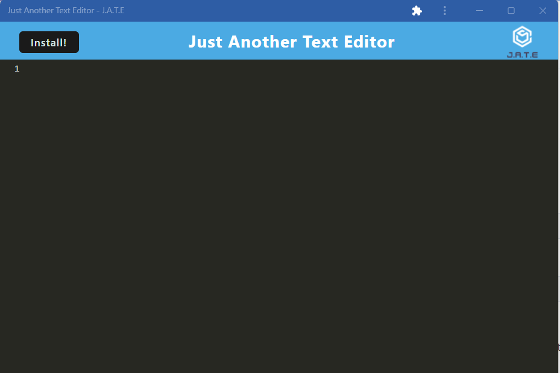

# Text-Editor
Welcome to the Text Editor - a browser-based application that functions as a powerful text editor. This project leverages Progressive Web App (PWA) features and data persistence techniques to ensure you can create and access your notes and code snippets with or without an internet connection. 

## Table of Contents

- [Installation](#installation)
- [Usage](#usage)
- [Contributing](#contributing)
- [License](#license)

## Installation
This application is deployed to heroku, which handles all the back-end functionality. To access the text-editor, please visit the deployed heroku application: 
https://text-editor-999999-7a68a819edf0.herokuapp.com/

To use the app offline, please click "install" on the top left corner of the page to download and install the application to your local machine, ready to use whenever you need it! Your notes and code snippets are securely stored using IndexedDB, which ensures data persistence even if you're not connected to the internet. 

## Usage
When you open the text editor, IndexedDB immediately creates a database for data storage.
As you enter content and click off the DOM window, the text editor automatically saves your work to IndexedDB.
If you reopen the text editor after closing it, your content is seamlessly retrieved from IndexedDB.

## License
N/A